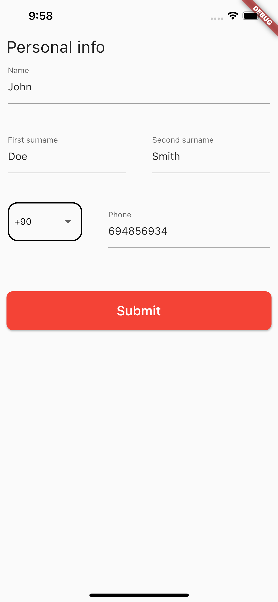

# better_forms 

This is a simple library to help building forms in Flutter.

# Usage
This is an example of how to use this package to create a pretty simple form.

````dart
class MyForm extends StatelessWidget {
  void _onSubmit(Map<String, String> map) {
    print(map);
  }

  @override
  Widget build(BuildContext context) {
    return Scaffold(
      body: SafeArea(
        child: Padding(
          padding: EdgeInsets.all(10),
          child: BFForm(
            title: Text(
              "Personal info",
              style: TextStyle(
                fontSize: 25,
              ),
            ),
            onSubmit: _onSubmit,
            fields: [
              BFFormGroup(
                fields: [
                  BFFormField(
                    name: "name",
                    title: "Name",
                  ),
                  BFFormField(
                    name: "surname",
                    title: "Surname",
                  ),
                ],
              ),
              BFFormField(
                name: "address",
                title: "Address",
              ),
              BFFormGroup(
                fields: [
                  BFDropdown<int>(
                    items: [
                      BFDropdownItem(displayValue: "Male", value: 1),
                      BFDropdownItem(displayValue: "Female", value: 2),
                    ],
                    hint: "Gender",
                    name: "gender",
                  ),
                  BFDatePicker(
                    dateFormat: "yyyy/MM/dd",
                    initialDate: DateTime.now(),
                    startingDate:
                        DateTime.now().subtract(Duration(days: 360 * 30)),
                    endDate: DateTime.now().add(Duration(days: 360 * 10)),
                    name: "birthdate",
                    placeholder: "Birthdate",
                  )
                ],
              ),
            ],
          ),
        ),
      ),
    );
  }
}
````

## Result
